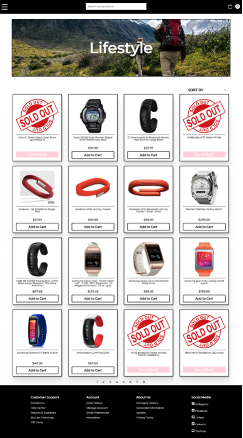
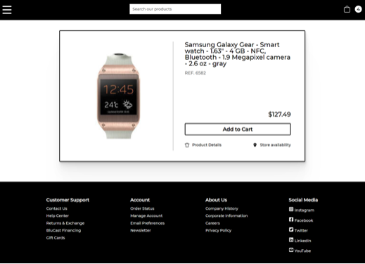

# Wearables Group E-Commerce Project

## Introduction

The main objective for our group project for Concordia University’s Full-Stack Web Development Diploma program was to create an e-commerce store that sells wearable technologies. Our goal was to develop a user-friendly website that allows customers to easily navigate through the dataset of 300+ products and to go through a purchase process once products had been added to their cart.

## Project Requirements

Frontend
Allow users to:
View all items in the database
Purchase items that are in stock
View a cart containing the items they intend to purchase
Edit cart before completing purchase

Backend
The node server should:
Be RESTful
Provide the frontend with the required data in a succinct and organized way
Update the inventory as users make purchases

## Packages Used

Frontend:
react-animations 
react-icons 
react-redux 
react-router-dom  

## Methodology and Languages

Our tech stack for this project included React.Js, Redux, and Node.Js while styling was primarily executed with Styled-Components. We divided the workload so that each team member had the opportunity to work on both backend and frontend aspects. This allowed us to gain valuable experience with each framework while also cementing our ability to collaborate effectively as a team.

## Features

• Animated burger menu
The hamburger menu is animated with opening and closing animations. The menu items also change position when clicked, and they also change positions if they have sub-menu-items.

• Searchbar
Customers can search and filter through the 300+ products offered on the e-commerce site.

• Filtering of products
Customers are able to filter and sort the products by various parameters such as company name, category, and price.

• Pagination
To make viewing the products more user-friendly, we implemented pagination to allow users to scroll through pages instead of having all the products on the same page.

• Tax calculations
Customers are prompted to select their home province upon checkout. Once they have specified their province, the appropriate taxes are then automatically calculated and added to their total purchase cost.

• Database update
Whenever a certain product is added in the cart, the quantity is updated in the database at the same time, which in turn updates the redux state at the frontend. This enables a live change of the product quantity at every click. This also makes it possible to maintain the maximum number of specific items that the customers can purchase.

• Local storage
Since the project uses redux states for rendering the most updated data, it was imperative to store those states locally using local storage, and update redux state using local storage. This ensures that the entire state persists when the user reloads the page or opens the application again while the server is running.

